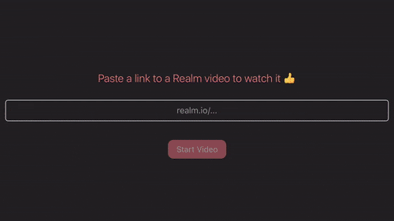
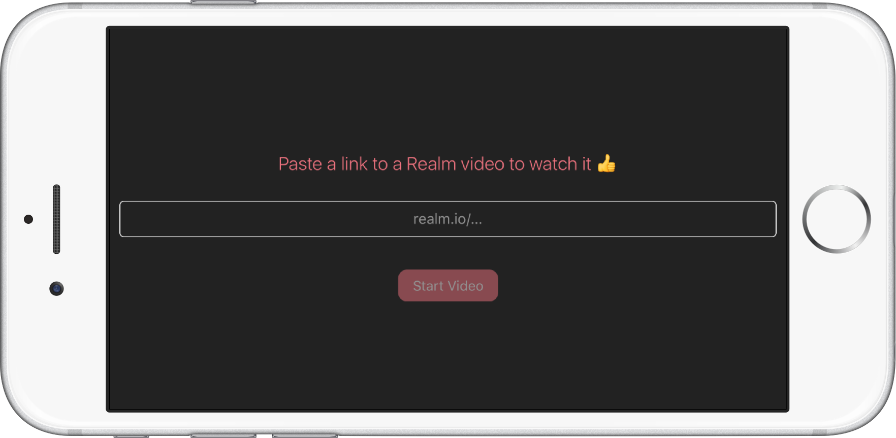
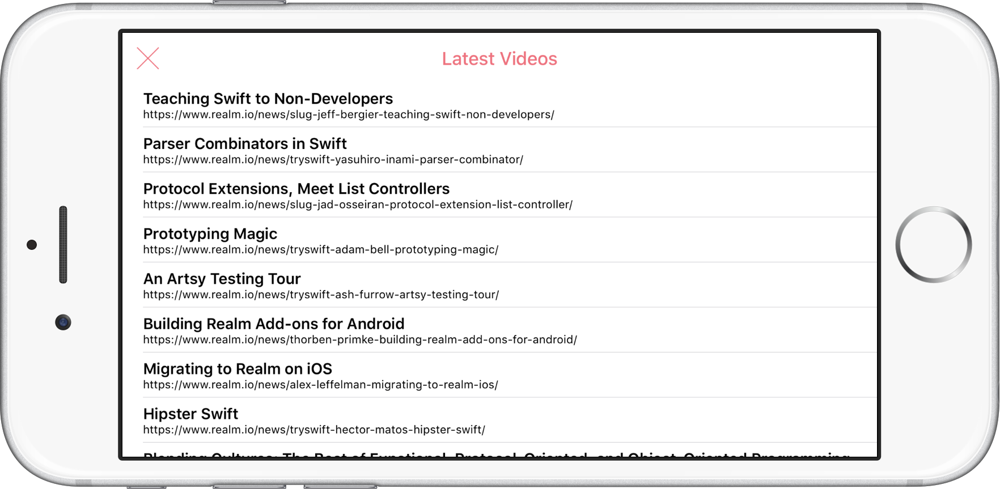
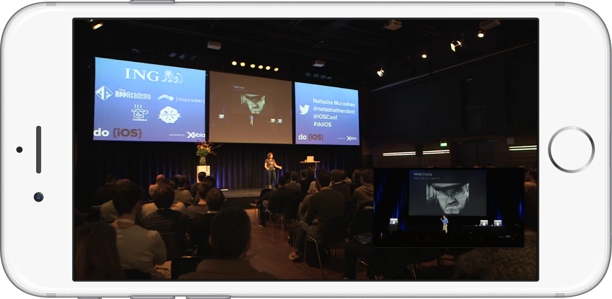
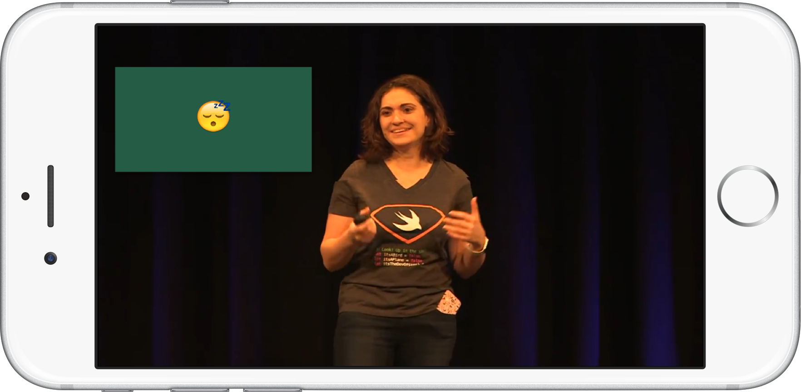

# Realm Video

## Description
[Realm](http://realm.io) is an amazing resource to watch different talks from various conferences and meetups. They publish videos and slides of each talk and it's all great as long as you are not watching them from your iPhone or iPad. In that case, as soon as you start the video, a `MPMovieViewController` will take all the space on your screen and the slides are not visible. Video without slides is 👎

[@realm](https://twitter.com/realm) is aware of the issue but there is no real workaround as you can see from this [tweet](https://twitter.com/realm/status/727178454932832258). Until now.

## Implementation
Realm Video uses a `UIWebView` to take advantage of the great Realm website with the slides being automatically in sync with the video. A Javascript function is used to locate the video element on the page and scroll to it. The HTML element that takes care of showing the slides is also located by finding its id. A `MPMovieViewController` object is presented as soon as the video is started and a `UIView` is added on top of it by accessing the window hierarchy. A function runs in the background every second and renders a screenshot of the current slide in the `UIWebView`. In this way, we keep the video and slides always in sync. The rendered image is then added to the floating `UIView` to be always visible to the user.

A few cool features:

- Single tap on the slides to hide them. Tap again to show them again. 👌
- Double tap to change the position of the slides between top left, top right, bottom left and bottom right. 🔁
- Pause the video and start again whenever you want. ⏯
- Skip forward or backward in the video and see the slides automatically syncing with the video. 🆒

This project was developed in ~7 hours. It was tested on an iPhone 6s Plus only and it could use some more work to turn it into a real app. Pull requests are very welcome!

## Installation
No dependencies, nothing. Download, open in Xcode, build & run, enjoy. 😎

## Contributing
You are very welcome to add new features and fix bugs. Feel free to open as many issues and pull requests as you want. 😏

## Author
I'm [Patrick Balestra](http://www.patrickbalestra.com).
Email: [me@patrickbalestra.com](mailto:me@patrickbalestra.com)
Twitter: [@BalestraPatrick](http://twitter.com/BalestraPatrick).

## License
RealmVideo is available under the MIT license. See the [LICENSE](LICENSE) file for more info.

## Disclaimer
Realm uses a few different video providers. The app was tested with Youtube videos a few a other services. If you find a page that is not compatible, please open an issue or submit a pull request. 

## More images

